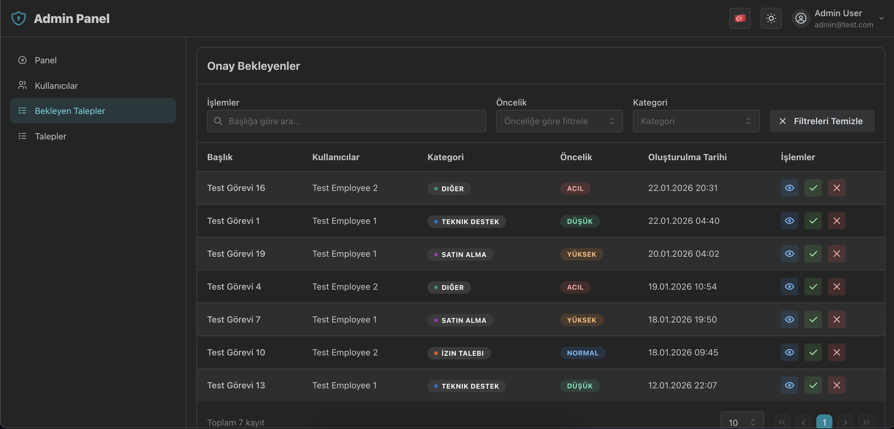
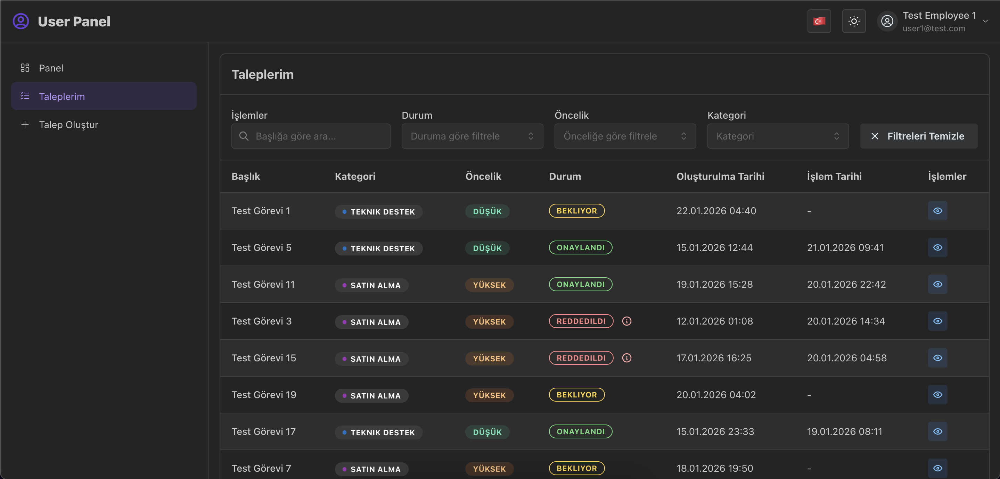

# Task Approval System 🚀

Profesyonel, rol tabanlı ve modern bir Talep Onay Sistemi. Bu proje, monorepo mimarisi (TurboRepo), merkezi çevre değişkenleri ve Docker desteği ile "tak-çalıştır" (plug-and-play) olarak tasarlanmıştır.

<p align="center">
  
  
</p>

## 🛠️ Hızlı Kurulum

Projeyi ayağa kaldırmak için tek ihtiyacınız **Docker**. Herhangi bir `.env` ayarı yapmanıza gerek yoktur, gerekli tüm ayarlar repoya dahildir.

```bash
# Projeyi bilgisayarınıza indirin
git clone https://github.com/furkancakici/task-approval-system.git
cd task-approval-system

# Projeyi Docker ile başlatın
docker compose up

# Sistem hazır!
# Admin Paneli: http://localhost:3001
# Kullanıcı Paneli: http://localhost:3000
# API: http://localhost:4000
```

---

### 🌍 Teknik Detaylar

- **Core Stack**: React, Node.js (Express), TypeScript.
- **Architecture**: Monorepo (TurboRepo) ile yönetilen ölçeklenebilir yapı.
- **Database**: Prisma ORM ve PostgreSQL (Docker üzerinde hazır gelir).
- **Real-time**: Socket.io ile anlık ve senkronize veri güncellemeleri.
- **UI/UX**: Mantine UI ile modern, karanlık mod destekli ve premium tasarım.
- **Security**: JWT tabanlı kimlik doğrulama ve Route korumaları.
- **i18n**: Türkçe ve İngilizce dil desteği.
- **Code Quality**: Husky ve lint-staged ile otomatik kod formatlama (Prettier) ve linting (ESLint) kontrolleri.

### 🏗️ Proje Mimarisi

Bu projede, modern web standartlarında "Client-Server" ayrımına dayalı, asenkron ve olay güdümlü (event-driven) bir mimari ile **TurboRepo** tabanlı bir **Monorepo** yapısı tercih edilmiştir.

#### 🔄 Genel Sistem Akışı

1. **Frontend (App Layer)**: Kullanıcılar, Vite ve Mantine UI ile güçlendirilmiş, tip güvenli (TypeScript) arayüzler üzerinden işlem yapar.
2. **Backend (API Layer)**: Talepler, Express tabanlı REST API tarafından karşılanır. İş mantığı servis katmanlarında yürütülür ve Prisma ORM ile PostgreSQL veritabanına kalıcı olarak işlenir.
3. **Real-time Sync**: Veri tabanında bir değişiklik olduğunda (yeni talep, onay vb.), API üzerinden tetiklenen WebSockets (Socket.io) sinyalleri tüm panellere anlık bildirim göndererek sayfaların yenilenmeden güncellenmesini sağlar.
4. **Shared Layer**: Tüm bu katmanlar, `@repo/*` paketleri üzerinden ortak şemaları, tipleri ve bileşenleri kullanarak hatasız bir veri bütünlüğü içinde çalışır.

#### 📦 Monorepo Avantajları

- **Merkezi Yönetim**: Admin ve User panel gibi iki farklı React uygulamasının tüm ortak paket, component ve tip tanımlarını tek bir yerden yönetmek.
- **Paylaşılan Kod**: Uygulamalar arası tutarlılığı sağlamak için aşağıdaki paketler merkezi olarak yönetilmektedir:
  - `@repo/ui`: Merkezi component kütüphanesi (Mantine tabanlı).
  - `@repo/socket`: Real-time iletişim katmanı (Client & Server hooks).
  - `@repo/store`: Merkezi state yönetimi (Redux).
  - `@repo/schema`: Ortak veri şemaları (Zod / Prisma).
  - `@repo/types`: Ortak TypeScript tip tanımları.
  - `@repo/i18n`: Çoklu dil destek altyapısı.
  - `@repo/services`: Ortak iş mantığı ve API servisleri.
  - `@repo/mantine`: Mantine UI konfigürasyon ve temaları.
  - `@repo/shared`: Ortak yardımcı fonksiyonlar ve animasyon kütüpkaneleri.
  - `@repo/eslint-config`, `@repo/typescript-config`, `@repo/postcss-config`: Ortak geliştirme ve derleme konfigürasyonları.
- **Performans**: TurboRepo'nun akıllı önbellekleme (caching) mekanizması ile geliştirme ve build süreçlerini maksimum hızda tutmak.

## ✨ Temel Özellikler

### 🔐 Rol Tabanlı Erişim (RBAC)

- **Admin**: Tüm kullanıcıları ve talepleri yönetebilir.
- **Moderator**: Talepleri onaylayabilir/reddedebilir ve kullanıcı listesini görebilir.
- **Viewer**: Sadece talepleri ve detayları görüntüleyebilir (İşlem yetkisi yoktur).
- **User**: Kendi taleplerini oluşturabilir ve durumlarını takip edebilir.

### 🏢 Gelişmiş Paneller

- **Merkezi Dashboard**: Bugünün onay/red istatistikleri ve öncelik dağılımı grafikleri.
- **Talep Yönetimi**: Başlık veya talep sahibine göre arama, öncelik ve duruma göre filtreleme.
- **Detay Görünümü**: Taleplerin tüm detaylarını (açıklama, işlem tarihi vb.) gösteren şık modal.
- **Kullanıcı Yönetimi**: Adminler için kullanıcı oluşturma ve düzenleme (Ad, E-posta, Rol, Şifre).

---

## 🔑 Test Kullanıcıları

| Rol           | E-posta            | Şifre     |
| :------------ | :----------------- | :-------- |
| **Admin**     | admin@test.com     | admin123  |
| **Moderator** | moderator@test.com | mod123    |
| **Viewer**    | viewer@test.com    | viewer123 |
| **User**      | user1@test.com     | 123456    |

---
